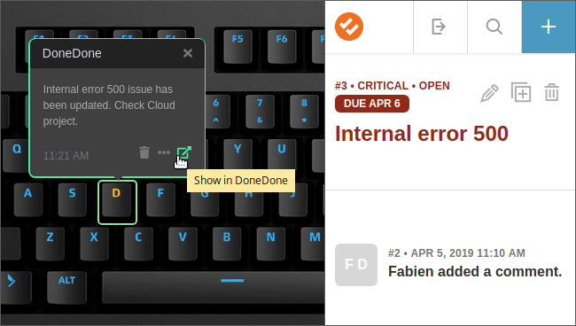

# DoneDone

This applet displays issues updates based on activity:

- New opened issues
- New closed issues
- New updated issues (new comment, priority, status, etc.)

From planning, to coding, to testing, to customer support, DoneDone is the straightforward bug and issue tracker.

For more information visit <https://getdonedone.com/>.

This applet uses the API from [DoneDone](https://www.getdonedone.com/api/).
